This is my version of a website builder.

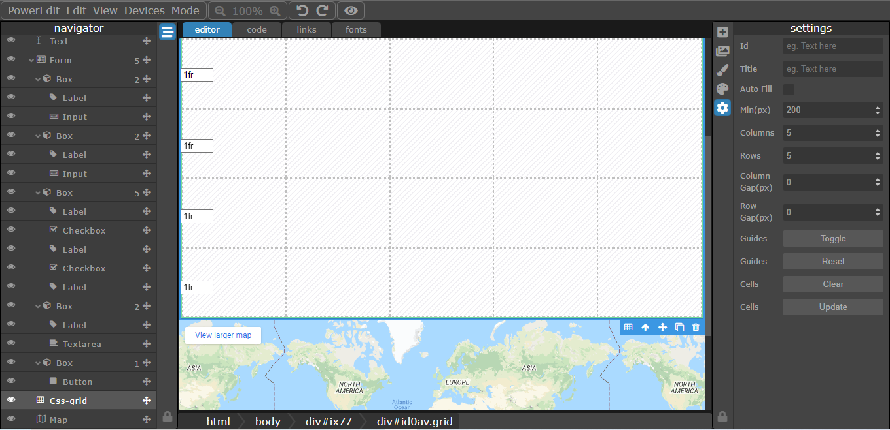

I am going to be doing a complete rewrite to this editor as I find it is to constrictive in a few areas that i need fixed so this project will be available to anyone that wants to play around with it.
This project if free to use just please add me to ur credits :)

To access download the project:
- download via npm clone
- run 'npm i' in the poweredit/poweredit folder ([root folder]/poweredit)
- run 'node app' (if u wish to run it on a port that isnt 80 run 'node app [port number]' like 'node app 1010'
- u can access the editor by going to http://admin.testwebsite.localhost/
- username is 'admin' and password is 'password' (without hyphens)
- have fun :)

editor features:
 - website and sites list with routing (assuming u have the site domain mapped)
 - page navigator (page structure viewer)
 - basic and manual styles editor
 - links manager
 - google fonts importer
 - image importer
 - full html/css/js code editor
 - flow/absolute mode and a dynamic mix of both for control over placing
 - other basic things you would expect like a preview, size changer to view on different screens with media queries . . .

for images of the editor go to the 'peScreenshots' folder

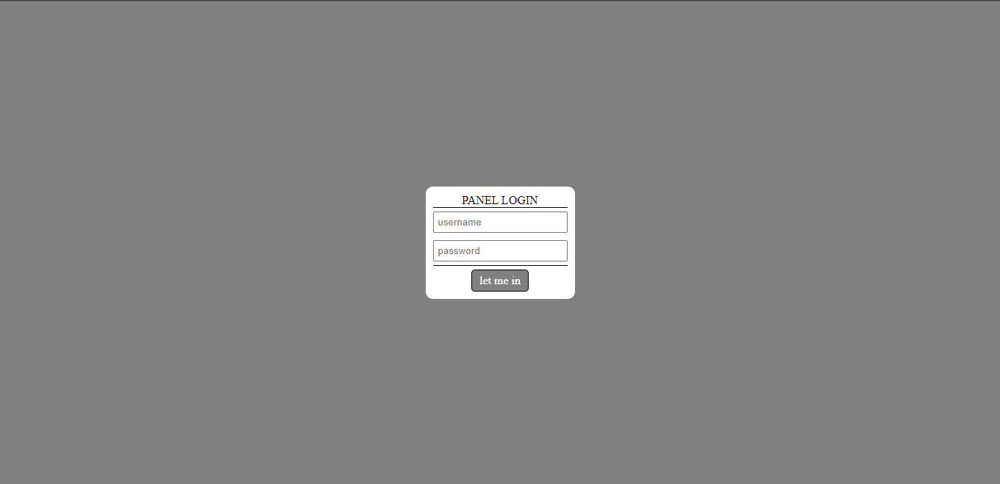
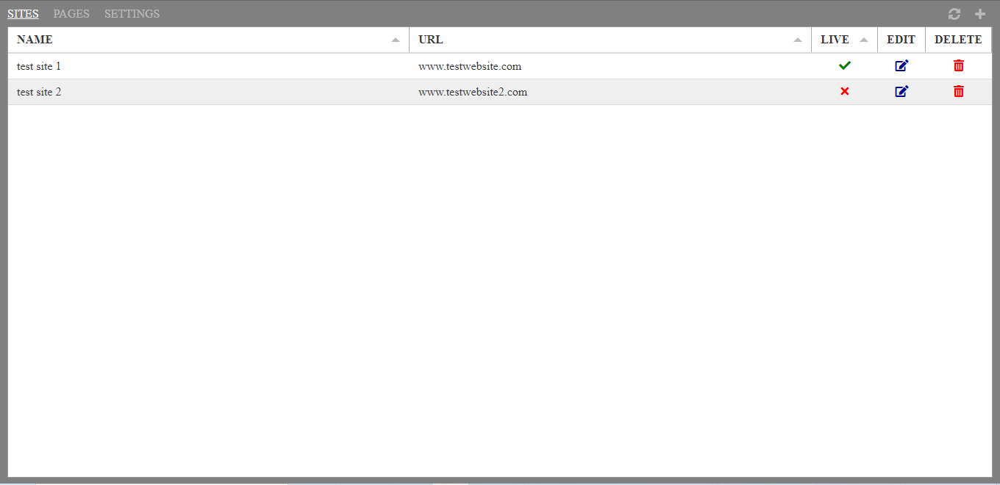
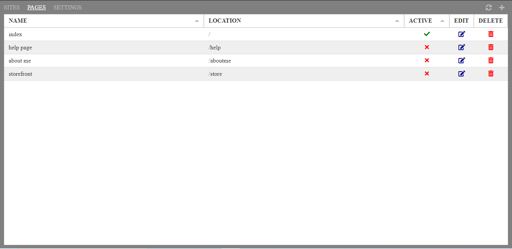

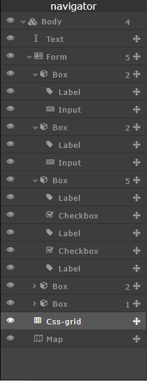
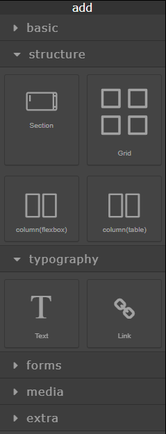
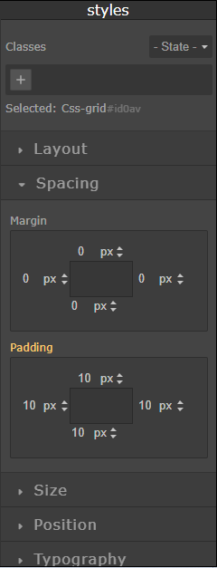
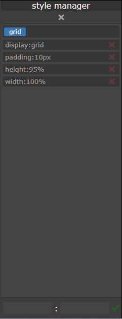

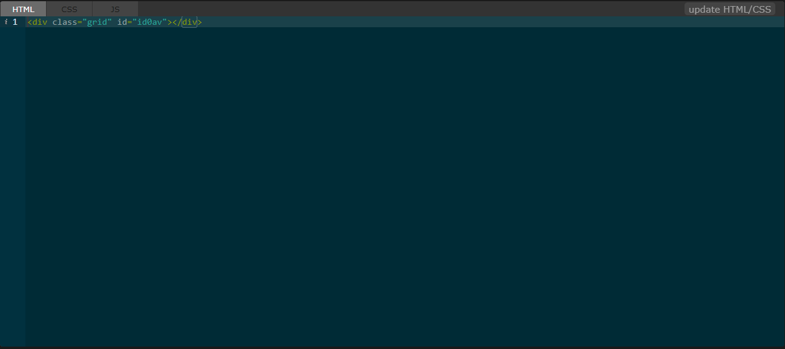
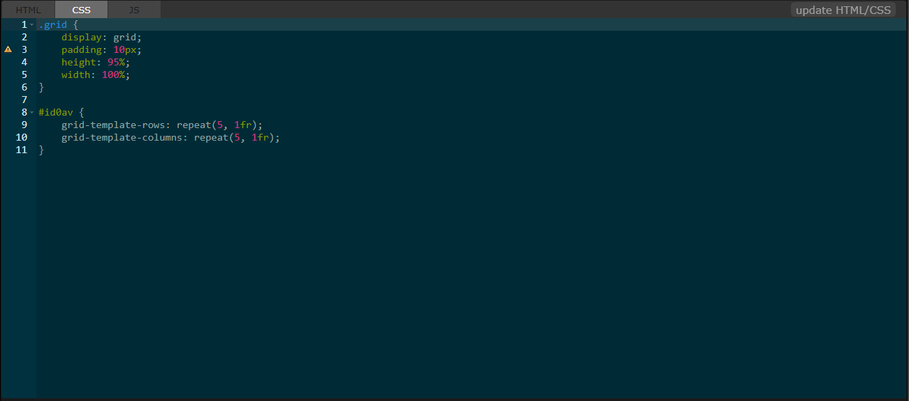
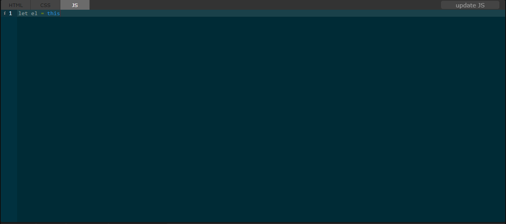

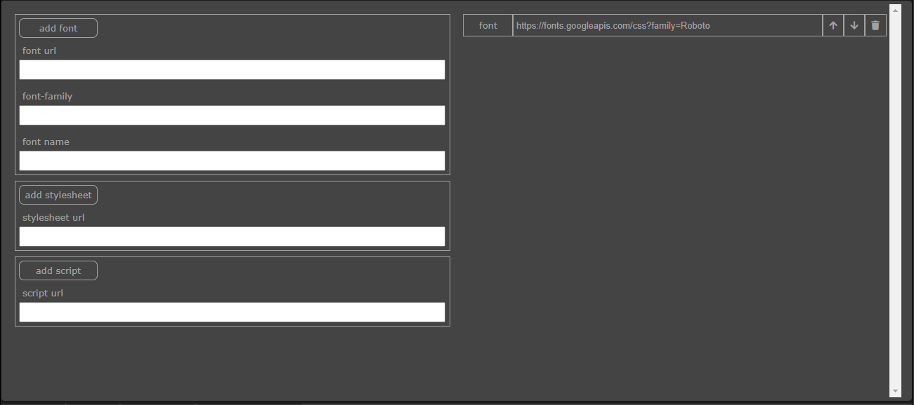

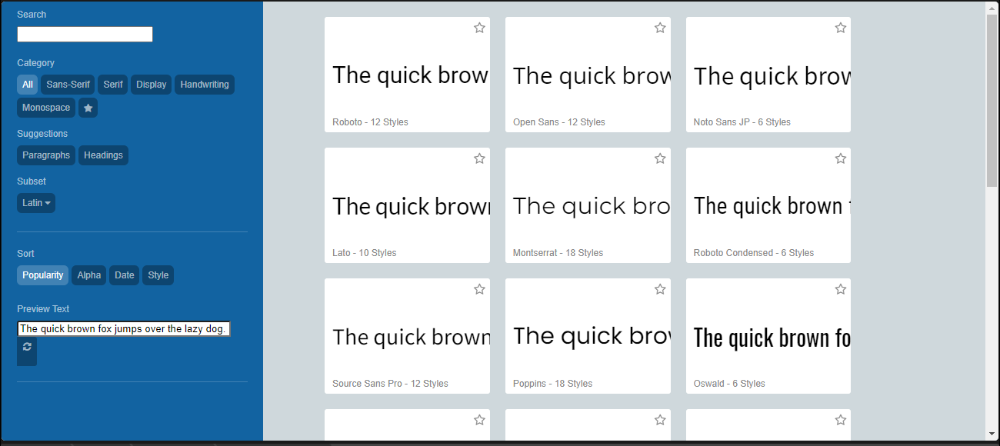

when viewing the log in the powereshell or whatever terminal you are using . . . the numbers indicate the total image transfer sizes when saving the page
